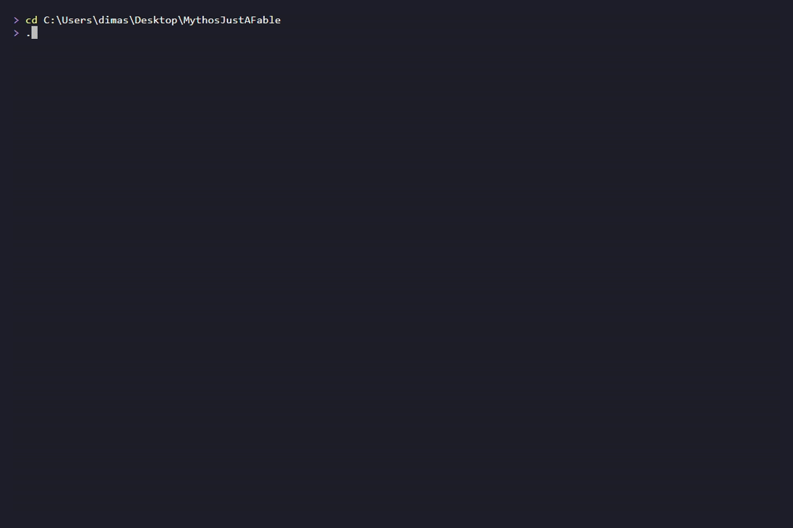

# Helios

<p align="center">
  
</p>

Helios is a command-gate policy layer for Claude Code and other AI agent tool execution environments.

It turns shell execution into an explicit, auditable protocol. Before an agent can run a `Bash` or `PowerShell` command, it must create a matching single-use gate file that explains what the command is, why it is needed, what output is expected, how the result should be interpreted, and what decision the result supports.

Each command an LLM wants to execute must go through a JSON gate file with a valid pre-execution command hash. The agent makes the request by filling out the gate schema parameters and running the command. Once the hash validates against the declared scope and schema, the gate returns context for that one-off command and surfaces any errors found during pre-execution validation. The gate binds the command to declared intent, forcing the agent to explain:

- **why** the command is needed
- **what** the expected output is
- **what** the actual output means
- **why** the next command is needed

Helios does not decide whether a command is "morally okay." It decides whether this exact command, in this exact shell, from this exact working directory, with this exact hash and declared risk boundary, is eligible to reach Claude Code's normal permission flow.

Helios is not model-specific. Any model or agent can operate through it if it can write a valid `.gate.json` file and follow the gate lifecycle. The purpose is not only command safety. Helios also creates clean evidence boundaries for studying when an AI system is blocked, routed, or confused: command text, structured reasoning, command output, expected-vs-actual comparison, or next-command derivation.

## Getting Started

### Prerequisites

- **Windows 10+** — PowerShell 5.1 is included. PowerShell Core (`pwsh`) also works.
- **Linux** — PowerShell Core (`pwsh`) 7.4+. Tested on Void Linux (glibc). Lock features require `chattr`/`lsattr` and root privileges.
- **macOS** — PowerShell Core (`pwsh`) 7.4+. Tested on macOS 14.6.1 (23G93). Lock features use `chflags` (uchg/nouchg) and `ls -lO` for status. User-level — no root required. Active runtime locking deferred until Akashic fixture and installer Prepare pass.
- **Claude Code** — installed and available in terminal (`claude` command).
- **Git** — for cloning the repository.

### Install

```bash
git clone https://github.com/dimascior/Helios-.git
cd Helios-
```

The repository ships ready to use. No build step, no package install, no path configuration.

```text
Helios-/
  .claude/settings.json                    Hook wiring (relative paths, works on any machine)
  .command-gate/
    hooks/
      helios_pretooluse.ps1                Front controller — manifest/baseline integrity before policy
      gate_check.ps1                       Gate validation — hash, cwd, tier, segments, chain linkage
      tier_classifier.ps1                  Risk tier classification and capability flag detection
      command_decomposer.ps1               Segment decomposition and chain structure validation
      evidence_capture.ps1                 PostToolUse/PostToolUseFailure uniform evidence writer
      control_plane_watcher.ps1            Enforcement-path snapshots and before/after diff
      session_continuity.ps1               Session ledger — pretooluse_seen, gate_consumed, evidence_written
      lib/
        HeliosIntegrityBridge.ps1          Vendored Akashic bridge for envelope snapshots
    policy/
      command-policy.json                  Tier patterns, write indicators, capability patterns, control-plane paths
    manifest/
      helios-envelope.json                 Protected-file SHA-256 manifest
      helios-envelope.sha256               Sidecar hash of the manifest itself
      helios-install-origin.json           Install origin metadata
    schemas/                               JSON Schema definitions
    templates/                             Gate templates and catalog entries (optional)
    pending/                               Gates waiting to be consumed (empty on clone)
    inflight/                              Gates currently executing (empty on clone)
    evidence/                              Completed gates and sidecars (empty on clone)
    blocked/                               Rejected command records (empty on clone)
    session/                               Append-only session ledger (runtime state, gitignored)
    posttooluse-errors/                    PostToolUse heartbeat and error diagnostics (runtime)
  README.md
  LICENSE
```

### Activate

Open the project in Claude Code:

```bash
cd Helios-
claude
```

Claude Code reads `.claude/settings.json` on startup and registers the hooks automatically. No manual hook configuration is needed. The hooks use relative paths (`Join-Path $PWD`) and the scripts derive their own root from `$PSScriptRoot`, so nothing is hardcoded to a specific machine.

### Verify

Run any shell command. If Helios is active, the PreToolUse hook blocks it and reports what is needed:

```text
GATE REQUIRED: No valid gate found in pending/ for this command.
Tier: 0. SHA256: 9f2b...c4a1. Category: routine.
```

This confirms the gate system is working. The agent must now write a `.gate.json` file in `pending/` with the reported SHA-256 and retry the command.

### Add Helios to an existing project

Copy two things into your project root:

1. `.command-gate/` — the entire directory (hooks, policy, and empty runtime directories)
2. `.claude/settings.json` — the hook wiring

```bash
cp -r Helios-/.command-gate /path/to/your/project/
cp -r Helios-/.claude /path/to/your/project/
```

The hooks activate the next time Claude Code opens that project. Add the runtime directories to your project's `.gitignore`:

```gitignore
.command-gate/pending/*.json
.command-gate/inflight/*.json
.command-gate/evidence/*.json
.command-gate/evidence/*.txt
.command-gate/blocked/*.json
.command-gate/debug_payloads/*.json
.claude/settings.local.json
```

## Design Principles

### The hash is not the trust boundary

The hash binds to the exact command string, not to a human-authorized allowlist. If the model is allowed to write gates, then the model can generate both sides: command and gate. The hash mainly prevents drift. It proves that the explanation, cwd, shell, tier, stop conditions, and evidence plan correspond to the exact command that is about to run. It stops "explain one command, run another."

### Base fields are cheap enough to leave on

The base fields are short: `need`, `expected`, `actual_means`, and `next_logic`. The gate program treats those as required even for Tier 0 and Tier 1, while Tier 2 adds `stop_conditions` and Tier 3 adds `read_write_impact`. The overhead is mostly a few hundred tokens plus one gate file write, not a major runtime cost compared with the value: it prevents the model from silently changing command purpose after seeing output.

Tier 0 can be terse. Tier 2/3 should be explicit. For experimental model testing, leaving it on is also cleaner because it keeps the instrumentation constant. If you toggle it, you add another variable: now you cannot tell whether a guardrail changed because of command content, explanation content, or missing explanation structure.

### The gate is binding and observable

Authorization comes from Tier 4 hard blocks, Claude Code's permission flow, and whatever human or local policy controls whether eligible commands actually execute. The gate is consumed once. Rerunning the same command needs a new gate, even if the command text is identical.

## Core Idea

A command is not allowed merely because the model wants to run it.

A command becomes eligible for normal Claude Code permission flow only when a gate exists in `pending/` and matches all of these conditions:

- exact command text
- SHA-256 of the exact command text
- current working directory
- shell name, `bash` or `powershell`
- unexpired timestamp
- sufficient risk tier
- required schema fields
- exit-capture policy
- write-impact declaration when the command can modify state
- multi-command declaration when chaining is used
- capability-required impact when inline interpreters, dynamic eval, or encoded execution are detected
- segment match between declared segments and decomposed command structure
- evidence-chain linkage to the previous command's evidence (or explicit new-chain declaration)

A valid gate does not auto-approve execution. It only allows the command to proceed to the normal permission layer.

## Lifecycle

```text
pending/   -> PreToolUse validates -> inflight/ -> PostToolUse captures -> evidence/
blocked/   <- denied attempts
session/   <- append-only session ledger (pretooluse_seen, gate_consumed, posttooluse_evidence_written)
```

The gate lifecycle is single-use.

1. The agent attempts a `Bash` or `PowerShell` command.
2. Claude Code fires the `PreToolUse` hook.
3. `helios_pretooluse.ps1` runs as front controller: verifies the protected-file manifest and session baseline are intact, loads the control-plane snapshot, checks session continuity against the session ledger, then loads policy and proceeds to gate validation.
4. `gate_check.ps1` reads the hook payload, extracts `tool_input.command`, computes the SHA-256 of the exact command string, and classifies the command tier via `tier_classifier.ps1` (including capability flags for inline interpreters, dynamic eval, encoded execution, nested shells, and control-plane path references).
5. Tier 4 commands are blocked unconditionally, even if a gate exists.
6. If no valid gate exists, the hook blocks the command and reports the required SHA-256.
7. If a valid gate exists, the hook validates every field — command text, hash, cwd, shell, expiry, risk tier, required fields, write-impact declarations, exit-capture rules, chain rules, capability-required impact, segment match via `command_decomposer.ps1`, and evidence-chain linkage — then moves it to `inflight/` and returns `{}`.
8. Claude Code proceeds through its normal permission flow.
9. After execution, `evidence_capture.ps1` looks for the matching inflight gate — preferably by `tool_use_id`, then falls back to command hash. It captures a post-execution control-plane snapshot via `control_plane_watcher.ps1`, compares it against the pre-execution snapshot, checks settings integrity, classifies the command independently, and writes uniform evidence sidecars (`.result.json`, `.gate.json`, `.tool_response.json`, `.stdout.txt`, `.stderr.txt`) containing forensic fields: `detected_tier`, `capability_flags`, `policy_hash`, `hook_versions`, `enforcement_surface`, `segments_match`, `watched_path_diffs`, `settings_integrity_after`, and `session_continuity_status`. It appends a `posttooluse_evidence_written` entry to the session ledger and moves the consumed gate to `evidence/`.
10. The evidence hook injects context telling the agent to compare expected output against actual output before creating the next gate. If control-plane files changed, this is reported in the injected context.

The agent can discover the hash by first attempting the command without a gate, reading the denied SHA-256 from the block message, writing a matching gate, then retrying the exact same command text.

Gates that cannot be matched to an inflight record are logged as orphans with a generated correlation ID.

## Lifecycle Examples by Tier

### Tier 0 — Routine

A simple directory check. Only base fields required.

**1. Agent attempts command without a gate:**

```text
> pwd; echo EXIT=$?
```

**2. PreToolUse blocks and reports the SHA-256:**

```text
GATE REQUIRED: No valid gate found in pending/ for this command.
Tier: 0. SHA256: 9f2b...c4a1. Category: routine.
```

**3. Agent writes gate file** `pending/pwd-check.gate.json`:

```json
{
  "schema_version": "command-gate.v1",
  "correlation_id": "pwd-check",
  "created_utc": "2026-06-25T12:00:00Z",
  "expires_utc": "2026-06-26T12:00:00Z",
  "command": "pwd; echo EXIT=$?",
  "command_sha256": "9f2b...c4a1",
  "working_directory": "C:\\Users\\you\\project",
  "shell": "bash",
  "risk_tier": 0,
  "exit_capture": "suffix",
  "multi_command": true,
  "segments": ["pwd", "echo EXIT=$?"],
  "need": "Verify the current working directory before writing the next gate.",
  "expected": "The output should show the project path and end with EXIT=0.",
  "actual_means": "If the path matches and EXIT=0, the cwd baseline is valid.",
  "next_logic": "Use the observed cwd as working_directory for the next gate.",
  "approval_boundary": "This gate makes the command eligible for permission flow only; it does not auto-approve execution."
}
```

**4. Agent retries. PreToolUse validates and returns `{}`** — command proceeds to Claude Code's normal permission flow.

Gate moves: `pending/pwd-check.gate.json` → `inflight/<tool_use_id>_pwd-check.gate.json`

**5. Command executes:**

```text
/c/Users/you/project
EXIT=0
```

**6. PostToolUse captures evidence.** Gate moves to `evidence/` with sidecars:

```text
evidence/
  <tool_use_id>_pwd-check.gate.json        # consumed gate
  <tool_use_id>_pwd-check.result.json       # exit code, timing, match status
  <tool_use_id>_pwd-check.stdout.txt        # raw stdout
```

**7. Evidence hook injects context** into the agent's next turn:

```text
[EVIDENCE:pwd-check] Command succeeded. Compare EXPECTED from the gate vs ACTUAL output before creating the next gate.
```

---

### Tier 1 — Diagnostic

System inspection. Same base fields as Tier 0 — no additional requirements.

**1. Agent writes gate** `pending/list-processes.gate.json`:

```json
{
  "schema_version": "command-gate.v1",
  "correlation_id": "list-processes",
  "created_utc": "2026-06-25T12:05:00Z",
  "expires_utc": "2026-06-26T12:00:00Z",
  "command": "Get-Process node -ErrorAction SilentlyContinue; Write-Host \"EXIT=$LASTEXITCODE\"",
  "command_sha256": "a3d1...e7b2",
  "working_directory": "C:\\Users\\you\\project",
  "shell": "powershell",
  "risk_tier": 1,
  "exit_capture": "suffix",
  "multi_command": true,
  "segments": [
    "Get-Process node -ErrorAction SilentlyContinue",
    "Write-Host \"EXIT=$LASTEXITCODE\""
  ],
  "need": "Check if a Node.js process is running before starting the dev server.",
  "expected": "Either a process table showing node PIDs or empty output if none are running, followed by EXIT=0.",
  "actual_means": "If node processes appear, the dev server may already be running. If empty, safe to start.",
  "next_logic": "If no node process is running, create a gate to start the dev server.",
  "approval_boundary": "This gate makes the command eligible for permission flow only; it does not auto-approve execution."
}
```

**2. PreToolUse validates and returns `{}`.**

**3. Command output:**

```text
 NPM(K)    PM(M)      WS(M)     CPU(s)      Id  SI ProcessName
 ------    -----      -----     ------      --  -- -----------
     18    45.12      52.30       2.14    7832   1 node
EXIT=0
```

**4. Evidence captured.** The hook writes `.result.json` with the parsed `EXIT=0` and the full stdout.

---

### Tier 2 — Remote / Admin

Remote access commands. Requires `stop_conditions` in addition to base fields.

**1. Agent writes gate** `pending/ssh-uptime.gate.json`:

```json
{
  "schema_version": "command-gate.v1",
  "correlation_id": "ssh-uptime",
  "created_utc": "2026-06-25T12:10:00Z",
  "expires_utc": "2026-06-26T12:00:00Z",
  "command": "ssh deploy@staging.example.com 'uptime'; echo EXIT=$?",
  "command_sha256": "c8f4...19d3",
  "working_directory": "C:\\Users\\you\\project",
  "shell": "bash",
  "risk_tier": 2,
  "exit_capture": "suffix",
  "multi_command": true,
  "segments": [
    "ssh deploy@staging.example.com 'uptime'",
    "echo EXIT=$?"
  ],
  "need": "Verify staging server is reachable and check load before deploying.",
  "expected": "Uptime output showing the server is up with reasonable load averages, followed by EXIT=0.",
  "actual_means": "If uptime returns and load is under 4.0, the server is healthy enough to deploy to.",
  "next_logic": "If healthy, create a Tier 3 gate for the deploy command. If unreachable, stop and report.",
  "stop_conditions": [
    "Stop if SSH authentication fails or connection is refused.",
    "Stop if load average exceeds 4.0 — the server is under too much load to deploy."
  ],
  "approval_boundary": "This gate makes the command eligible for permission flow only; it does not auto-approve execution."
}
```

**2. PreToolUse validates.** If `stop_conditions` were missing:

```text
GATE REJECTED: closest gate ssh-uptime.gate.json matched sha256 but failed validation:
- missing tier-required fields: stop_conditions
```

With `stop_conditions` present, returns `{}`.

**3. Command output:**

```text
 12:10:05 up 42 days,  3:15,  2 users,  load average: 0.45, 0.62, 0.58
EXIT=0
```

**4. Evidence hook injects context:**

```text
[EVIDENCE:ssh-uptime] Command succeeded. Compare EXPECTED from the gate vs ACTUAL output before creating the next gate.
```

The agent reads the load averages, compares against the stop condition threshold, and decides whether to proceed.

---

### Tier 3 — Modifying

State-changing commands. Requires `stop_conditions` and `read_write_impact` in addition to base fields.

**1. Agent writes gate** `pending/push-main.gate.json`:

```json
{
  "schema_version": "command-gate.v1",
  "correlation_id": "push-main",
  "created_utc": "2026-06-25T12:15:00Z",
  "expires_utc": "2026-06-26T12:00:00Z",
  "command": "git push origin main; echo EXIT=$?",
  "command_sha256": "d2a7...f103",
  "working_directory": "C:\\Users\\you\\project",
  "shell": "bash",
  "risk_tier": 3,
  "exit_capture": "suffix",
  "multi_command": true,
  "segments": [
    "git push origin main",
    "echo EXIT=$?"
  ],
  "need": "Push the committed README update to the remote repository.",
  "expected": "Push output showing objects written and refs updated on origin/main, followed by EXIT=0.",
  "actual_means": "If push succeeds, the changes are live on the remote. If rejected, a pull or rebase is needed first.",
  "next_logic": "If push succeeds, report completion. If rejected as non-fast-forward, create a gate for git pull --rebase.",
  "stop_conditions": [
    "Stop if authentication fails.",
    "Stop if push is rejected as non-fast-forward — do not force push without explicit authorization."
  ],
  "read_write_impact": {
    "reads": ["local main branch history"],
    "writes": ["origin/main ref on remote repository"]
  },
  "approval_boundary": "This gate makes the command eligible for permission flow only; it does not auto-approve execution."
}
```

**2. PreToolUse validates.** If `read_write_impact` were missing or had `writes: ["none"]`:

```text
GATE REJECTED: closest gate push-main.gate.json matched sha256 but failed validation:
- write indicator detected but read_write_impact.writes is missing
```

With all fields present, returns `{}`.

**3. Command output:**

```text
Enumerating objects: 5, done.
Counting objects: 100% (5/5), done.
Writing objects: 100% (3/3), 722 bytes | 722.00 KiB/s, done.
To https://github.com/you/project.git
   a31f125..5a43d10  main -> main
EXIT=0
```

**4. Evidence sidecars:**

```text
evidence/
  <tool_use_id>_push-main.gate.json
  <tool_use_id>_push-main.result.json
  <tool_use_id>_push-main.tool_response.json   # full Claude Code tool response (capped 1MB)
  <tool_use_id>_push-main.stdout.txt
  <tool_use_id>_push-main.stderr.txt            # git progress output
```

---

### Tier 4 — Forbidden

Always blocked. No gate can authorize a Tier 4 command.

**1. Agent attempts command:**

```text
> rm -rf /
```

**2. PreToolUse blocks unconditionally:**

```text
TIER 4 BLOCKED: Command matches forbidden pattern. Category: destructive disk command.
No gate can authorize this command.
```

The block fires before gate matching. Even if a gate exists in `pending/` with a correct SHA-256, Tier 4 commands never reach the validation stage. The attempt is written to `blocked/` for audit.

## Directory Structure

```text
.command-gate/
  hooks/
    helios_pretooluse.ps1        Front controller — manifest/baseline integrity before policy load
    gate_check.ps1               Gate validation — hash, cwd, tier, segments, chain linkage
    tier_classifier.ps1          Risk tier, capability flags, chain, and write-indicator detection
    command_decomposer.ps1       Segment decomposition and declared-vs-detected validation
    evidence_capture.ps1         PostToolUse/PostToolUseFailure uniform forensic evidence writer
    control_plane_watcher.ps1    Enforcement-path snapshots and before/after diff comparison
    session_continuity.ps1       Session ledger writes and continuity audit
    lib/
      HeliosIntegrityBridge.ps1  Vendored Akashic bridge for envelope snapshots and integrity evidence
  policy/
    command-policy.json          Tier patterns, write indicators, capability patterns, control-plane paths
  manifest/
    helios-envelope.json         Protected-file SHA-256 manifest
    helios-envelope.sha256       Sidecar hash of the manifest itself
    helios-install-origin.json   Install origin metadata (watched, not protected)
  schemas/                       JSON Schema definitions for evidence, envelope, baseline, ledger, etc.
  templates/                     Gate templates and catalog entries
  pending/                       Gates waiting to be consumed
  inflight/                      Gates currently executing
  evidence/                      Completed gate records and sidecars
  blocked/                       Rejected command records
  session/                       Append-only session ledger (runtime state, gitignored)
  posttooluse-errors/            PostToolUse heartbeat and error diagnostics (runtime)
```

### Runtime File Inventory

| File | Role |
|---|---|
| `hooks/helios_pretooluse.ps1` | Front controller. Verifies manifest and session baseline integrity before loading policy. Captures pre-execution control-plane snapshot. Checks session continuity. Implements the maintenance rebaseline corridor. |
| `hooks/gate_check.ps1` | Validates gate files: command text, SHA-256 hash, working directory, shell, expiry, risk tier, required fields, segment match, capability-required impact, and evidence-chain linkage. |
| `hooks/tier_classifier.ps1` | Classifies commands by tier (0-4). Detects capability flags: inline interpreter execution, dynamic eval, encoded/obfuscated execution, nested shell execution, and control-plane path references. Exports `Get-CommandTier`, `Test-ChainViolation`, `Test-WriteIndicator`. |
| `hooks/command_decomposer.ps1` | Decomposes chained commands into segments. Validates that declared `segments` in the gate match the detected shell structure. Flags ambiguous parse results. |
| `hooks/evidence_capture.ps1` | PostToolUse/PostToolUseFailure hook. Writes uniform forensic evidence: `.result.json`, `.gate.json`, `.tool_response.json`, stdout/stderr files. Every result includes `detected_tier`, `capability_flags`, `policy_hash`, `hook_versions`, `enforcement_surface`, `segments_match`, `watched_path_diffs`, `settings_integrity_after`, and `session_continuity_status`. Appends session ledger entries. Writes heartbeat diagnostics. |
| `hooks/control_plane_watcher.ps1` | Snapshots watched enforcement paths (claude settings, hook scripts, policy, manifests, install origin) and compares before/after state. Exports `Get-ControlPlaneSnapshot`, `Compare-ControlPlaneSnapshots`, `Test-HookPresence`. |
| `hooks/session_continuity.ps1` | Manages the append-only session ledger (`session/session-ledger-<session_id>.jsonl`). Writes three event types: `pretooluse_seen`, `gate_consumed`, `posttooluse_evidence_written`. Exports `Write-SessionLedgerEntry`, `Test-SessionContinuity`, `Get-SessionLedger`. |
| `hooks/lib/HeliosIntegrityBridge.ps1` | Vendored copy of the Akashic bridge. Provides protected/mutable envelope snapshots, manifest comparison, session baseline management, and integrity evidence writing. |
| `policy/command-policy.json` | Tier regex patterns, write indicator patterns, capability patterns (inline interpreter, dynamic eval, encoded execution, nested shell), control-plane path patterns, and exit-capture policy. |
| `manifest/helios-envelope.json` | Protected-file manifest containing expected SHA-256 hashes for enforcement files. |
| `manifest/helios-envelope.sha256` | SHA-256 sidecar hash of the manifest JSON. |
| `posttooluse-errors/` | Heartbeat JSONL files and error records for PostToolUse execution diagnostics. Each invocation writes checkpoints: `started`, `parsed`, `identified`, `gate_matched`/`gate_orphan`, `classification_done`, `result_written`, `ledger_written`, `bridge_start`, `output_start`, `complete`. Errors are recorded at the checkpoint where they occur. |
| `session/` | Append-only session ledger files. Runtime state, not committed to git. |
| `pending/`, `inflight/`, `evidence/`, `blocked/` | Gate lifecycle directories. |

### Directory Integrity

On every invocation, `gate_check.ps1` checks that the gate root and all required subdirectories exist and are not reparse points (junctions or symlinks). This prevents an attacker from redirecting the gate store to a location they control.

### Tier Classification

The tier classifier loads patterns from `command-policy.json` at runtime and exports three functions: `Get-CommandTier`, `Test-ChainViolation`, and `Test-WriteIndicator`. Risk logic is not spread across memory or hooks; the policy file is the single operational source for tier patterns, write indicators, and capability patterns.

`Get-CommandTier` returns an expanded result that includes tier, matched pattern, capability flags (inline interpreter, dynamic eval, encoded execution, nested shell), reason codes, capability escalation status, and control-plane path references.

If an `operating-catalog.json` exists in `templates/`, the classifier checks it after Tier 4 but before Tier 3, allowing project-specific pattern overrides with template suggestions.

## Risk Tiers

| Tier | Category | Examples | Additional requirements |
|------|----------|----------|-------------------------|
| 0 | Routine | unlisted commands | base gate fields |
| 1 | Diagnostic | `ps`, `ls`, `cat`, `grep`, `Get-Process` | base gate fields |
| 2 | Remote/Admin | `ssh`, `sudo`, `tailscale ssh` | `stop_conditions` |
| 3 | Modifying | `rm`, `git push`, `npm install`, `Set-Content`, `mkdir` | `stop_conditions`, `read_write_impact` |
| 4 | Forbidden | destructive disk commands, credential dumping, unsafe pipe-to-shell patterns | always blocked |

Tier 4 commands are blocked even if a gate exists.

### Write Indicators

If a command matches any write indicator pattern (e.g., `git commit`, `rm`, `> `, `Set-Content`), the gate must declare `read_write_impact` with a non-empty, non-`["none"]` `writes` array — regardless of tier. This catches cases where a Tier 0 command still performs writes.

## Gate Schema

The gate file must be JSON and must be placed in `.command-gate/pending/` before the command is retried.

A minimal Tier 0 gate looks like this:

A valid gate must bind the exact command and include these required base fields:

```json
{
  "schema_version": "command-gate.v1",
  "correlation_id": "unique-gate-id",
  "created_utc": "2026-06-25T12:00:00Z",
  "expires_utc": "2026-07-02T12:00:00Z",
  "command": "pwd; echo EXIT=$?",
  "command_sha256": "<sha256 of exact command text>",
  "working_directory": "C:\\Users\\you\\project",
  "shell": "bash",
  "risk_tier": 0,
  "exit_capture": "suffix",
  "multi_command": true,
  "segments": [
    "pwd",
    "echo EXIT=$?"
  ],
  "need": "Verify the current working directory before writing the next gate.",
  "expected": "The output should show the active project path and end with EXIT=0.",
  "actual_means": "If the path matches the gate working_directory and EXIT=0 appears, the cwd baseline is valid.",
  "next_logic": "Use the observed cwd as working_directory for the next gate.",
  "approval_boundary": "This gate makes the command eligible for permission flow only; it does not auto-approve execution."
}
```

Important field names:

- Use `risk_tier`, not `tier`.
- Use `working_directory` that matches the actual Claude Code payload cwd.
- Use `shell` as lowercase `bash` or `powershell`.
- Use `command_sha256` for the exact command string, byte-for-byte.
- Gates are consumed once. Re-running the same command needs a new gate file and a new `correlation_id`.

## Conditional Fields

Tier 2 and Tier 3 gates require `stop_conditions`.

```json
"stop_conditions": [
  "Stop if the command fails authentication.",
  "Stop if the output does not match the expected target host."
]
```

Commands with write indicators require `read_write_impact.writes`. This is enforced independently of the detected tier.

```json
"read_write_impact": {
  "reads": [".command-gate/pending"],
  "writes": [".command-gate/evidence/rejected-tests"]
}
```

`writes` cannot be missing, empty, or `["none"]` when a write indicator is detected.

## Exit Capture

Exit capture is one of the most important design pieces. Claude Code's `PostToolUseFailure` payload does not include `tool_response`, so when a command exits nonzero normally, Helios may lose stdout, stderr, and exit code. Helios therefore requires commands to expose their own exit code as `EXIT=<number>` unless the gate explicitly marks exit capture as not applicable.

| Mode | When to Use | Behavior |
|------|------------|----------|
| `suffix` | Simple commands | Command ends with an approved exit-capture suffix (e.g., `; echo EXIT=$?`). Tool may exit nonzero and trigger `PostToolUseFailure`, losing `tool_response`. |
| `wrapper_required` | Commands that may fail | Wrapper captures the real exit code, prints `EXIT=<code>`, and exits 0. Tool always triggers `PostToolUse` so the evidence hook receives full output. Wrapper commands are exempt from chain detection. |
| `not_applicable` | No meaningful exit code | Requires an approved reason: `pure_output`, `no_exit_code_semantic`, `interactive_tool`, or `background_process`. |

### `suffix`

Use this when the command is expected to succeed normally and the shell can append a simple marker.

Bash:

```bash
pwd; echo EXIT=$?
```

PowerShell native executable:

```powershell
git status; Write-Host "EXIT=$LASTEXITCODE"
```

### `wrapper_required`

Use this when the semantic command may return a nonzero exit code and that nonzero result is meaningful diagnostic evidence. The wrapper captures the real exit code, prints `EXIT=<number>`, and exits `0` so Claude Code fires `PostToolUse` and provides `tool_response` to the evidence hook.

PowerShell example:

```powershell
$actualExit = 0
try {
    cmd /c "exit 1"
    $actualExit = $LASTEXITCODE
} catch {
    Write-Error $_
    $actualExit = 1
}
Write-Host "EXIT=$actualExit"
exit 0
```

Wrapper gates must declare the semantic command identity:

```json
"exit_capture": "wrapper_required",
"wrapped_command": "cmd /c \"exit 1\"",
"wrapped_command_sha256": "<sha256 of wrapped_command>",
"wrapper_reason": "The semantic command may return nonzero and must be captured as evidence rather than becoming a tool-level failure."
```

The full command hash protects the complete wrapper. The wrapped command hash documents the command being measured inside the wrapper. The full command must also pass structural validation: it must contain the shell-specific marker (`echo "EXIT=` for bash, `Write-Host "EXIT=` for PowerShell) and end with `exit 0`.

### `not_applicable`

Use this only when no meaningful exit code exists for the command.

```json
"exit_capture": "not_applicable",
"exit_capture_reason": "pure_output"
```

The reason must be approved by `command-policy.json`.

## Chain Detection

Commands containing `;`, `&&`, `||`, or `|` outside single-quoted strings are treated as chained commands. Chained commands must declare:

```json
"multi_command": true,
"segments": [
  "first command",
  "second command"
]
```

Undeclared chaining is blocked.

The detector is single-quote aware: operators inside `'...'` are exempted. Double-quote false positives deliberately overblock (safe direction). This is a strict policy — no chain exemptions exist except for wrapper-mode commands, where the wrapper structure is the approved pattern.

Exit-capture suffixes and wrapper scaffolding are handled by policy. If your command includes a suffix such as `; echo EXIT=$?`, either the suffix must be recognized as chain-exempt by `tier_classifier.ps1`, or the gate must declare the command as `multi_command: true` with `segments`.

## Diagnostics

The PreToolUse hook does not return a binary pass/fail. When it blocks a command, it returns structured context explaining exactly why the gate was rejected — which field was wrong, what the expected value was, what the actual value was, and what is still missing. The agent receives this context as part of the hook response and can use it to correct the gate and retry without guessing.

This is a deliberate design choice. A simple exit code 0 or 1 would force the agent into blind retry loops or require a human to diagnose every rejection. Instead, the hook acts as a validation report: it tells the agent what to fix, not just that something failed.

If no plausible gate exists, the hook reports:

```text
GATE REQUIRED: No valid gate found in pending/ for this command. Tier: 0. SHA256: <hash>. Category: routine.
```

If a pending gate has the same SHA-256 or command text but fails validation, the hook should report the closest rejection reason:

```text
GATE REJECTED: closest gate pwd-probe.gate.json matched sha256 but failed validation:
- working_directory mismatch
  gate:   C:\Users\you\project
  actual: C:\Users\you\project\src
```

Common diagnostics include:

- `field name error: found "tier"; expected "risk_tier"`
- `missing base fields: schema_version, correlation_id, created_utc, ...`
- `missing tier-required fields: need, expected, actual_means, next_logic`
- `working_directory mismatch`
- `expired gate`
- `risk_tier too low`
- `write indicator detected but read_write_impact.writes is missing`
- `EXIT CAPTURE REQUIRED`
- `UNDECLARED CHAINING`

Blocked attempts are written to `.command-gate/blocked/` for audit and recovery.

## Compaction Recovery Rules

After context compaction, do not rely on memory alone. Use this checklist before writing gates:

1. Gate and run `pwd` first to establish the current working directory.
2. Remember that `cd` changes cwd persistently for the session. Every later gate must use the new cwd.
3. Use `risk_tier`, not `tier`.
4. Include all base fields from the schema template.
5. Include `stop_conditions` for Tier 2 and Tier 3.
6. Include `read_write_impact.writes` for write commands.
7. Include an exit-capture mode.
8. Use far-future expiry for active work sessions.
9. Gates are single-use. Re-running a command requires a new gate.
10. If a gate fails, read the rejection reason from the hook or the matching file in `blocked/`.

## Fable / Guardrail Localization Use

Helios can be used as an instrumentation layer for Fable-style guardrail research.

The gate separates the execution loop into observable phases:

```text
command text -> gate fields -> command execution -> raw output -> expected-vs-actual comparison -> next-step derivation
```

That separation helps identify whether a model is being routed or blocked because of:

- the command string itself
- structured operational reasoning
- remote/admin context
- raw output text
- expected-vs-actual comparison
- root-cause analysis
- next-command derivation
- the full agentic control loop

For guardrail localization, do not give the tested model the full operator playbook at first. Feed one controlled lane at a time so the trigger can be isolated.

## Phase 4.4 Status

Phase 4.4 implemented the compound bypass awareness layer. Each component is live in the current runtime:

| Component | Description | Status |
|---|---|---|
| Capability classification | Detects inline interpreters, dynamic eval, encoded execution, nested shells, control-plane path references. Escalates tier when capability patterns match. | Implemented |
| Segment decomposition | Decomposes chained commands and validates declared `segments` against detected structure. Rejects mismatches. | Implemented |
| Uniform evidence | Every PostToolUse result includes `detected_tier`, `capability_flags`, `policy_hash`, `hook_versions`, `enforcement_surface`, `segments_match`, `watched_path_diffs`, `settings_integrity_after`, `session_continuity_status`. | Implemented |
| Control-plane watcher | Snapshots enforcement-relevant files before and after command execution. Reports diffs. | Implemented |
| Session continuity ledger | Append-only ledger with `pretooluse_seen`, `gate_consumed`, `posttooluse_evidence_written` events. Detects gaps and hook identity changes. | Implemented |
| Evidence-chain linkage | Gates must reference the previous evidence via `previous_correlation_id` or declare `new_chain: true` with reason. | Implemented |
| Settings integrity | PostToolUse evidence includes hook presence status, hook commands, and settings hash. | Implemented |
| PostToolUse heartbeat diagnostics | Every invocation writes checkpoint heartbeats. Errors are recorded at the checkpoint where they occur. | Implemented |
| Maintenance rebaseline corridor | `helios_pretooluse.ps1` supports bounded internal rebaseline via `maintenance/rebaseline-request.json`. | Implemented |
| Manifest/sidecar rebaseline | `tools/New-HeliosEnvelopeManifest.ps1` regenerates manifest and sidecar hash. | Implemented |

## Capability Status

| Capability | Helios | Akashic | Status |
|---|---|---|---|
| Command gate | Owns runtime enforcement | Installs/prepares runtime | Implemented |
| SHA-256 command hash | Validates exact command | N/A | Implemented |
| Protected-file manifest hash | Uses manifest/sidecar | Generates/verifies manifests | Implemented |
| PostToolUse evidence | Writes runtime evidence | Can audit via tools | Implemented |
| Capability classification | Owns classifier | N/A | Implemented |
| Segment decomposition | Owns decomposer | N/A | Implemented |
| Control-plane watcher | Owns live watcher | Verifies settings integrity | Implemented |
| Session continuity | Writes ledger and evidence | Provides forensic audit | Implemented |
| Installer | Consumes installed runtime | Owns PlanOnly/Prepare/Activate | Implemented |
| Signatures | Reads authority fields only | Schema language exists | Not implemented |
| File locks | Runtime target | Owns lock tooling | Tooling exists; active runtime locking deferred |

### Hashes

Implemented. `manifest/helios-envelope.json` contains protected-file SHA-256 hashes. `manifest/helios-envelope.sha256` is the manifest sidecar hash. Hashes prove byte-level drift against a known manifest. They do not prove human authorization by themselves.

### Signatures

Not implemented yet. The schemas support authority language (`authority_type`, `authorization_method`, `authorization_proof_present`, `authorization_proof_ref`), but cryptographic signing is deferred. Current authority is claim-based (`self_reported` or `tool_reported`). The sidecar is a SHA-256 hash, not a signature.

### File Locks

Lock tooling exists in Akashic. Backends are documented for Windows (`icacls`), Linux (`chattr`), macOS (`chflags`), and POSIX (`chmod`) fallback. Fixtures have been validated across platforms. Active Helios runtime locking remains deferred unless a later activation explicitly applies locks.

## Configuration Details

### How paths resolve

No hardcoded paths exist anywhere in Helios.

- **Hook scripts** derive `$GateRoot` from their own filesystem location using `Split-Path $PSScriptRoot -Parent`. This always resolves to the `.command-gate/` directory containing `hooks/`, regardless of where the project is cloned.
- **`.claude/settings.json`** uses `Join-Path $PWD` to build hook command paths at runtime. Claude Code sets `$PWD` to the project root when hooks fire.

### Local overrides (optional)

`.claude/settings.local.json` is gitignored. No local configuration is required — the committed config is complete. Use `settings.local.json` only if you need to override paths (e.g., shared `.command-gate/` location) or change the hook timeout.

### Global hooks (alternative)

If you prefer hooks to apply to every Claude Code session rather than per-project, add the hook configuration to `~/.claude/settings.json` with absolute paths to the scripts.

### Verifying the hook payload

To confirm Claude Code is delivering the expected payload structure to the hooks, inspect the `debug_payloads/` directory after running a command. The PreToolUse payload should contain `tool_name`, `tool_input.command`, `cwd`, and `tool_use_id`. The PostToolUse payload should additionally contain `tool_response.stdout` and `tool_response.stderr`.

## Validation Checklist

Before relying on Helios for real work, verify:

- no-gate command is blocked and reports SHA-256
- valid gate moves `pending/` to `inflight/` to `evidence/`
- expired gate is rejected with an expiry diagnostic
- cwd mismatch is reported clearly
- `tier` vs `risk_tier` mistake is reported clearly
- write-indicator command with `writes: ["none"]` is rejected
- undeclared chain is rejected
- Tier 4 command is blocked even with a gate
- wrapper-required command captures semantic `EXIT=<number>` through `PostToolUse`
- `PostToolUseFailure` records failure even when `tool_response` is missing
- inline interpreter command without `read_write_impact` is rejected (capability escalation)
- declared segments that don't match decomposed structure are rejected
- gate without `previous_correlation_id` or `new_chain: true` after existing evidence is rejected
- PostToolUse `.result.json` contains `detected_tier`, `capability_flags`, `policy_hash`, `hook_versions`, `enforcement_surface`
- command that modifies a watched file produces `watched_path_diffs` in evidence
- PostToolUse heartbeat reaches `complete` checkpoint without error entries
- session ledger records `pretooluse_seen`, `gate_consumed`, and `posttooluse_evidence_written` for each command

## License

MIT
